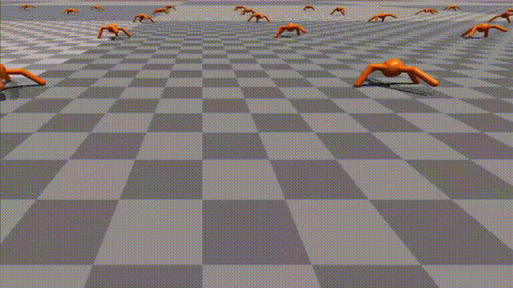
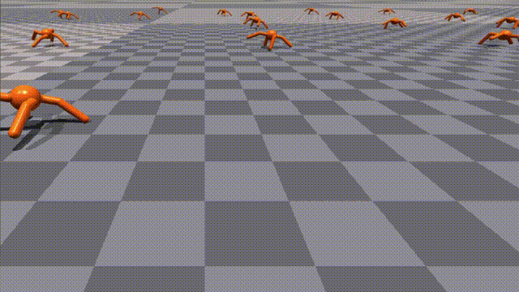
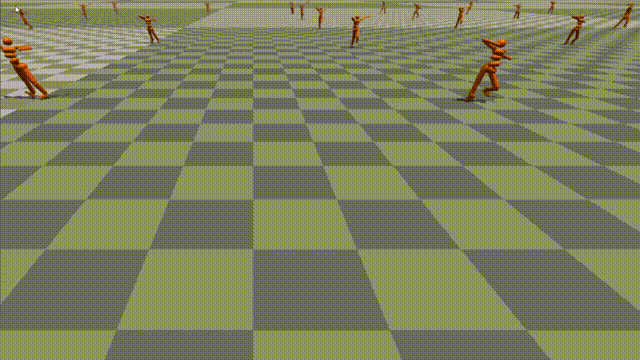
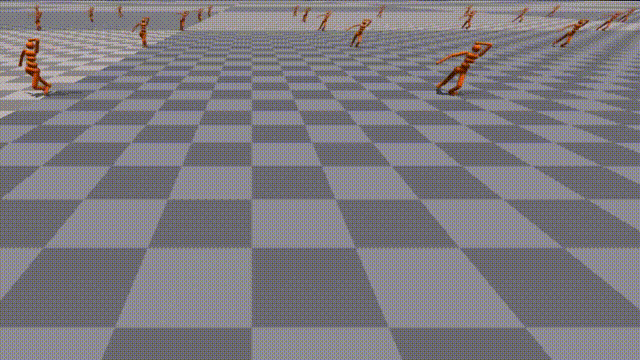

# Safe Constrained Isaac Gym (SCIG) benchmark

### About this repository

This repository contains example safe RL tasks and baselines 

### Installation

Download the Isaac Gym Preview 3 release from the [website](https://developer.nvidia.com/isaac-gym), then
follow the installation instructions in the documentation. We highly recommend using a conda environment 
to simplify set up.

Ensure that Isaac Gym works on your system by running one of the examples from the `python/examples` 
directory, like `joint_monkey.py`. Follow troubleshooting steps described in the Isaac Gym Preview 3 
install instructions if you have any trouble running the samples.

Once Isaac Gym is installed and samples work within your current python environment, install this repo:

```bash
pip install -e .

cd rl_games
pip install -e .
```

### Running the benchmarks

Ant two cost task:
To train your first policy, run this line:  

```bash
python isaacgymenvs/train.py task=Ant2Cost experiment=xxx num_envs=32 train=Ant2P3O project=xxx
python isaacgymenvs/train.py task=Ant2Cost experiment=xxx num_envs=32 train=Ant2PPOLag project=xxx
```

Note that by default we show a preview window, which will usually slow down training. You 
can use the `v` key while running to disable viewer updates and allow training to proceed 
faster. Hit the `v` key again to resume viewing after a few seconds of training, once the 
ants have learned to run a bit better.

Use the `esc` key or close the viewer window to stop training early.

Alternatively, you can train headlessly, as follows:

```bash
python isaacgymenvs/train.py task=Ant2Cost experiment=xxx num_envs=32 train=Ant2P3O project=xxx headless=True
```

Ant may take a minute or two to train a policy you can run. When running headlessly, you 
can stop it early using Control-C in the command line window.

### Loading trained models // Checkpoints

Checkpoints are saved in the folder `runs/EXPERIMENT_NAME/nn` where `EXPERIMENT_NAME` 
defaults to the task name, but can also be overridden via the `experiment` argument.

To load a trained checkpoint and continue training, use the `checkpoint` argument:

```bash
python train.py task=Ant2Cost checkpoint=runs/xx/nn/Ant.pth
```

To load a trained checkpoint and only perform inference (no training), pass `test=True` 
as an argument, along with the checkpoint name. To avoid rendering overhead, you may 
also want to run with fewer environments using `num_envs=32`:

```bash
python train.py task=Ant2Cost checkpoint=runs/xx/nn/Ant.pth test=True num_envs=32
```

Note that If there are special characters such as `[` or `=` in the checkpoint names, 
you will need to escape them and put quotes around the string. For example,
`checkpoint="./runs/Ant/nn/last_Antep\=501rew\[5981.31\].pth"`

### Demo
|  task   | PPO  | Constraint algorithm  | note|
|  ----  | ----  |----  |----  |
| Ant  |  |  |add energy usage and joint degrees of freedom constraint|
| Humanoid  |  |  |add energy usage and joint degrees of freedom constraint|
### Baselines
- PPOLag:      Benchmarking Safe Exploration in Deep Reinforcement Learning
- PPOLagPid:   Responsive Safety in Reinforcement Learning by PID Lagrangian Methods
- P3O:         Penalized Proximal Policy Optimization for Safe Reinforcement Learning
- FOCOPS:      First Order Constrained Optimization in Policy Space
- SACLag (SACLag-Qc, SACLag-FirstQc, SACLag-Meancost)
### Configuration and command line arguments

We use [Hydra](https://hydra.cc/docs/intro/) to manage the config. Note that this has some 
differences from previous incarnations in older versions of Isaac Gym.
 
Key arguments to the `train.py` script are:

* `task=TASK` - selects which task to use. Any of `Ant2Cost`, `AntSpeedCost`, `Humanoid2Cost`, `HumanoidSpeedCost` ... (these correspond to the config for each environment in the folder `isaacgymenvs/config/task`)
* `train=TRAIN` - selects which training config to use. Will automatically default to the correct config for the environment (ie. `<TASK>PPO`).
* `num_envs=NUM_ENVS` - selects the number of environments to use (overriding the default number of environments set in the task config).
* `seed=SEED` - sets a seed value for randomizations, and overrides the default seed set up in the task config
* `sim_device=SIM_DEVICE_TYPE` - Device used for physics simulation. Set to `cuda:0` (default) to use GPU and to `cpu` for CPU. Follows PyTorch-like device syntax.
* `rl_device=RL_DEVICE` - Which device / ID to use for the RL algorithm. Defaults to `cuda:0`, and also follows PyTorch-like device syntax.
* `graphics_device_id=GRAHPICS_DEVICE_ID` - Which Vulkan graphics device ID to use for rendering. Defaults to 0. **Note** - this may be different from CUDA device ID, and does **not** follow PyTorch-like device syntax.
* `pipeline=PIPELINE` - Which API pipeline to use. Defaults to `gpu`, can also set to `cpu`. When using the `gpu` pipeline, all data stays on the GPU and everything runs as fast as possible. When using the `cpu` pipeline, simulation can run on either CPU or GPU, depending on the `sim_device` setting, but a copy of the data is always made on the CPU at every step.
* `test=TEST`- If set to `True`, only runs inference on the policy and does not do any training.
* `checkpoint=CHECKPOINT_PATH` - Set to path to the checkpoint to load for training or testing.
* `headless=HEADLESS` - Whether to run in headless mode.
* `experiment=EXPERIMENT` - Sets the name of the experiment.
* `project=PROJECT` - Sets the name of the project.(wandb project)
* `max_iterations=MAX_ITERATIONS` - Sets how many iterations to run for. Reasonable defaults are provided for the provided environments.

Hydra also allows setting variables inside config files directly as command line arguments. As an example, to set the discount rate for a rl_games training run, you can use `train.params.config.gamma=0.999`. Similarly, variables in task configs can also be set. For example, `task.env.enableDebugVis=True`.

#### Hydra Notes

Default values for each of these are found in the `isaacgymenvs/config/config.yaml` file.

The way that the `task` and `train` portions of the config works are through the use of config groups. 
You can learn more about how these work [here](https://hydra.cc/docs/tutorials/structured_config/config_groups/)
The actual configs for `task` are in `isaacgymenvs/config/task/<TASK>.yaml` and for train in `isaacgymenvs/config/train/<TASK>PPO.yaml`. 

In some places in the config you will find other variables referenced (for example,
 `num_actors: ${....task.env.numEnvs}`). Each `.` represents going one level up in the config hierarchy.
 This is documented fully [here](https://omegaconf.readthedocs.io/en/latest/usage.html#variable-interpolation).

## Tasks

Source code for tasks can be found in `isaacgymenvs/tasks`. 

Each task subclasses the `VecEnv` base class in `isaacgymenvs/base/vec_task.py`.

Refer to [docs/framework.md](docs/framework.md) for how to create your own tasks.

Full details on each of the tasks available can be found in the [RL examples documentation](docs/rl_examples.md).
